- Configuración inicial

 - Configuración del sitio web
     - [Crea una cuenta en GitHub](https://github.com/signup?ref_cta=Sign+up&ref_loc=header+logged+out&ref_page=%2F&source=header-home) si no lo has hecho
     - Crea una "bifurcación" (fork) del [repositorio](https://github.com/morelrep/BibAV). Cuando se abra la página del repositorio bifurcado, guárdala en favoritos, pues tendrás que regresar aquí al final del proceso.
         -  
     - Haz click en el archivo ```Public.bib```
         - 
         - 
     - Haz click en "descargar" en la esquina superior derecha. Recuerda la ubicación pues lo necesitarás en el próximo paso.
         - 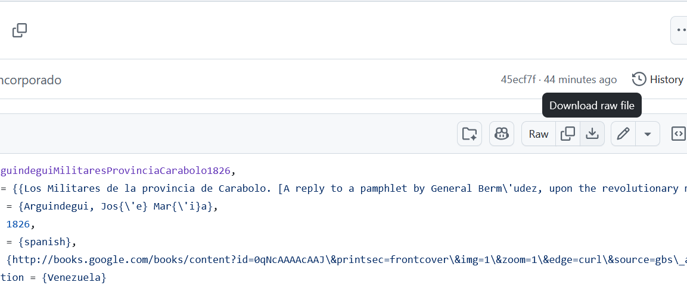
     - En la barra superior haz click en "Acciones" y ahí haz click en el botón verde grande, para habilitarlas.
         - 
         - 
     - Vuelve a "código" en la esquina superior izquierda, abre el archivo ```_config.yml``` y selecciona "editar" en la esquina superior derecha
         - 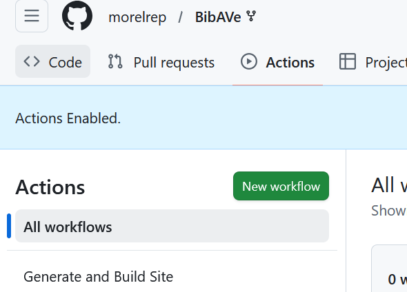
         - 
     - Edita los campos ```title``` y ```tagline``` con información sobre tu curso, seminario o taller. Debes hacer al menos un pequeño cambio para que se dispare la generación del sitio.  Cuando hayas hecho el cambio haz click en el botón verde en la esquina superior derecha, para confirmar cambios
         - 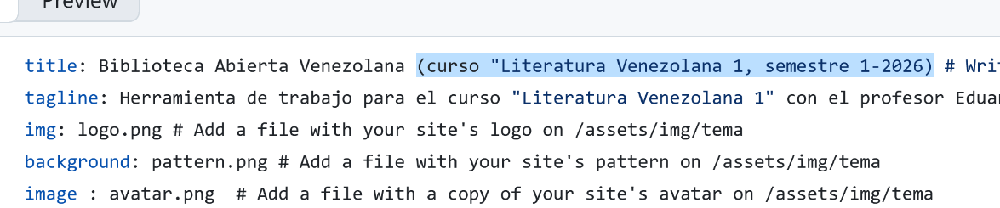
         - 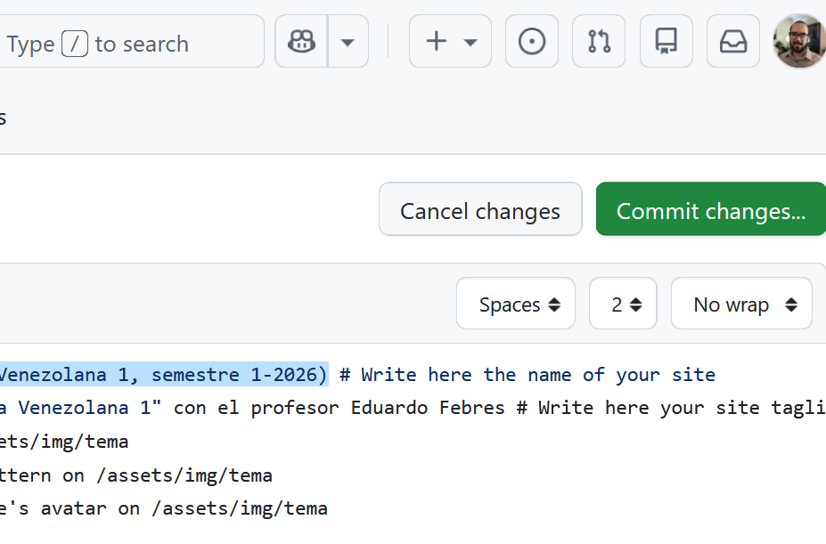
     - ¡Casi listo! Solo tienes que esperar unos minutos a que el sitio se genere. Ve a "configuración" en la esquina superior derecha y busca en la barra lateral la opción de "páginas". Ahí, selecciona la rama ```gh-pages``` para generar el sitio. No olvides guardar para terminar.
         - 
         - 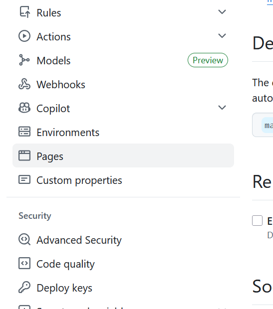
         - 
         - 
     - ¡Listo! Refresca la página apretando ```F5``` y haz click en el link que aparecerá en el tope de la página, para abrir tu copia de BibAV, lista para asignarle una biblioteca grupal y crear actividades de enseñanza.
     
- Configuración de la biblioteca grupal

    - [Crea una cuenta en Zotero](https://www.zotero.org/user/register) si no lo has hecho

    - [Ingresa](https://www.zotero.org/user/login/) en tu cuenta de Zotero, ve a la [sección de "grupos"](https://www.zotero.org/groups) y crea uno nuevo
     - Elige la privacidad. La recomendable es la segunda: público con membresía cerrada. Mantén la configuración predeterminada.
     - Ve a la configuración de miembros, y envía una invitación a tus estudiantes
 
         - 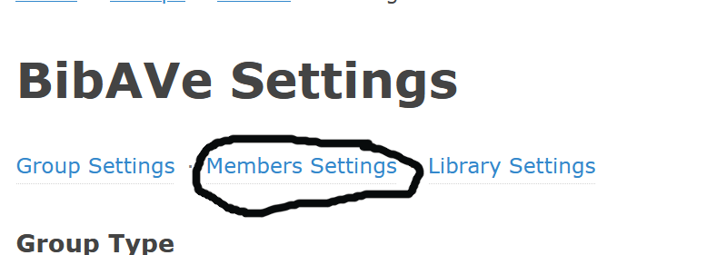
         - 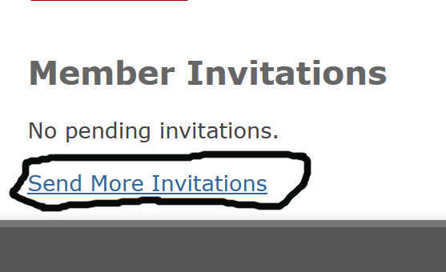
         - 
     - Abre tu cliente Zotero de escritorio (local) y encuentra en la columna izquierda el grupo que acabas de crear. Selecciónalo.
 
         - 
     - Ve al menú ```Archivo > Importar...``` y selecciona el archivo ```Public.bib``` que descargaste de GitHub
 
         - 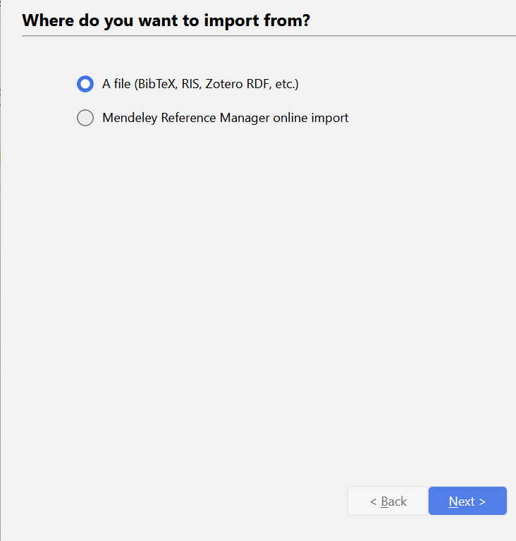
         - 
         - 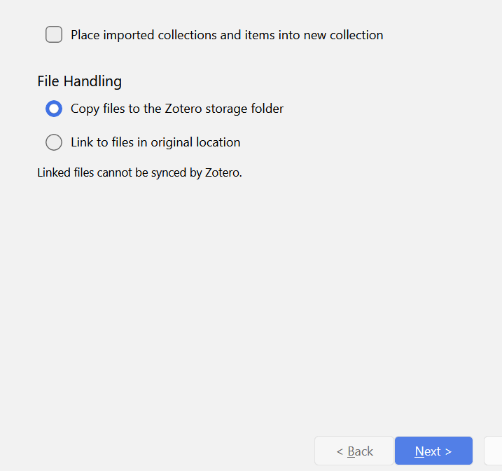

     - Ya tienes una copia de BibAV lista para trabajar en el aula de clases, que estará sincronizándose con tu biblioteca grupal en línea. Ahora solo queda enlazarla a la página que creaste en el primer paso.

 - Enlazando la biblioteca grupal al sitio web

     - Vuelve a Zotero y elige "grupos" en el menú principal
         - 
         - 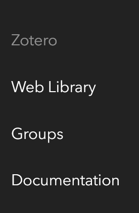
     - Copia el número que aparece en la url del grupo
         - 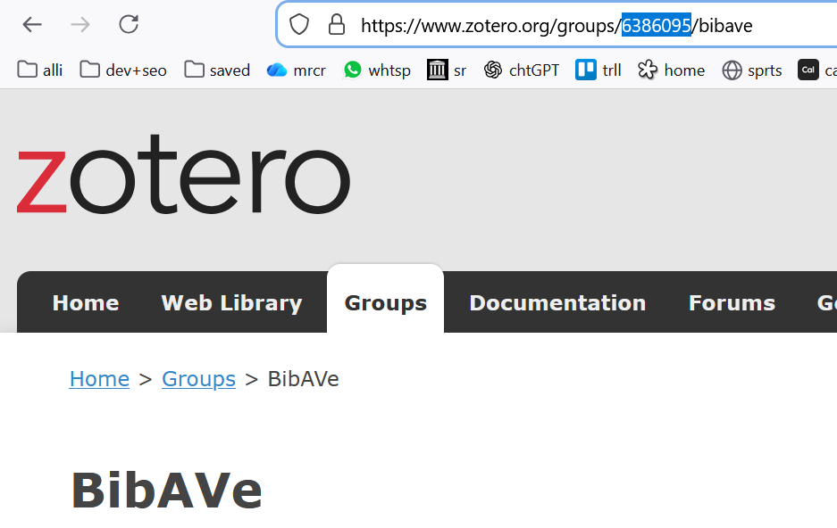
         - 
     - Vuelve a la página del repositorio, que guardaste en "favoritos", y abre el archivo ```_config.yml```